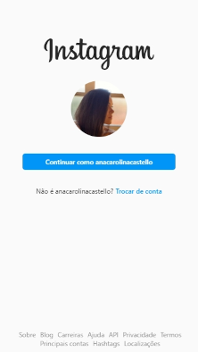

# :sparkles: Clone da página inicial do instagram

Clone da página inicial do instagram desenvolvido para o bootcamp HTML Web Developer da Digital Innovation One.

> Veja a página [aqui](https://anacarolinacastello.github.io/clone-pagina-inicial-instagram/index.html).
## Linguagens

- HTML

- CSS

## Authors

- [@anacarolinacastello](https://github.com/anacarolinacastello/)
